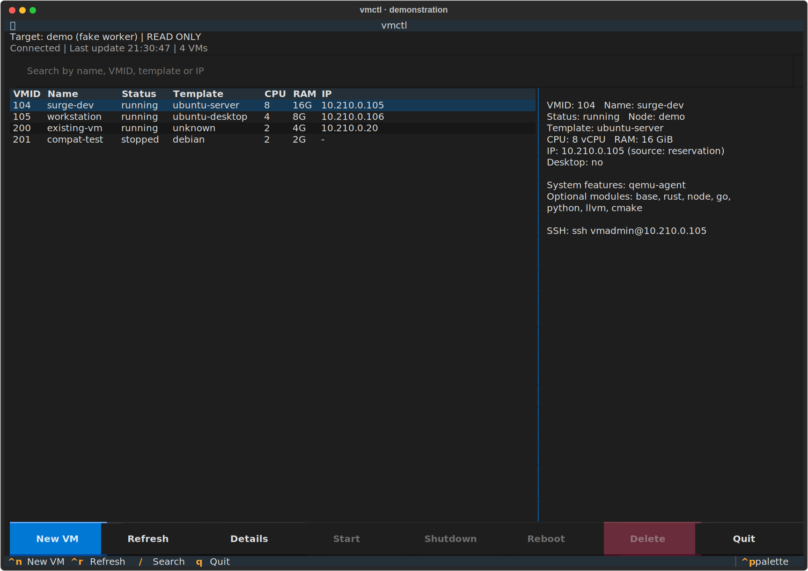
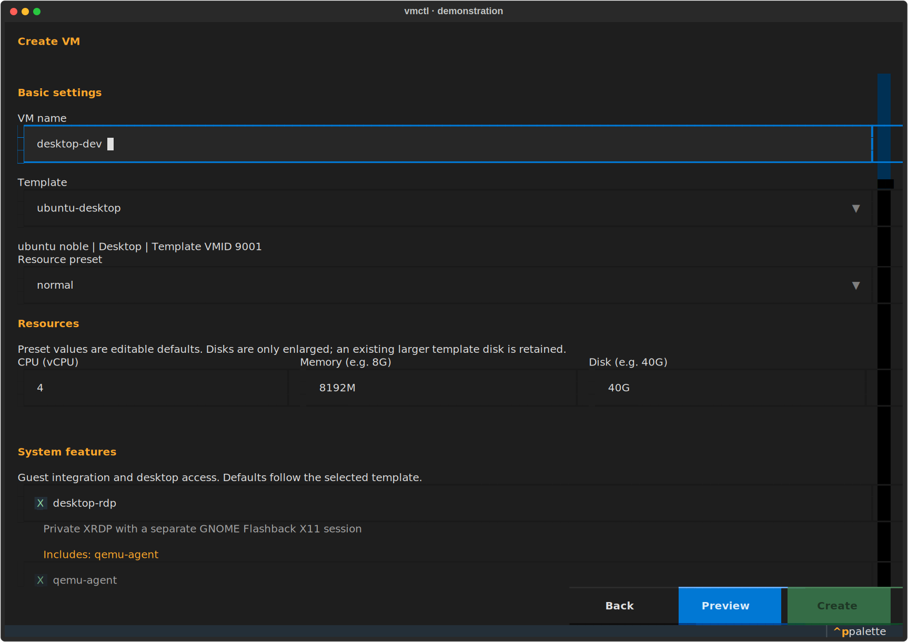
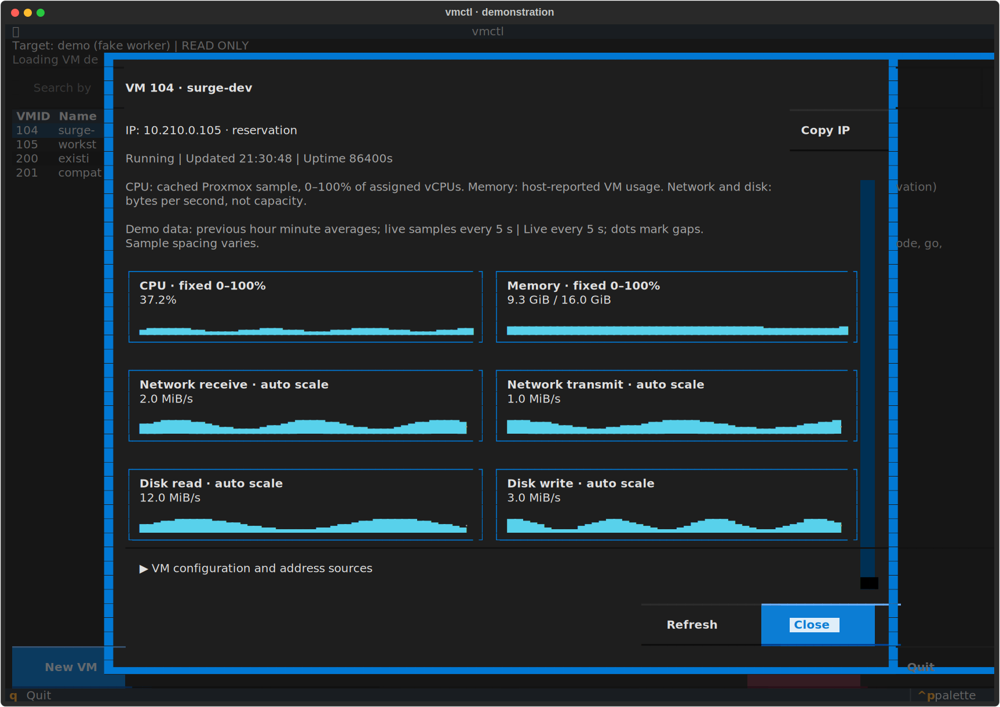
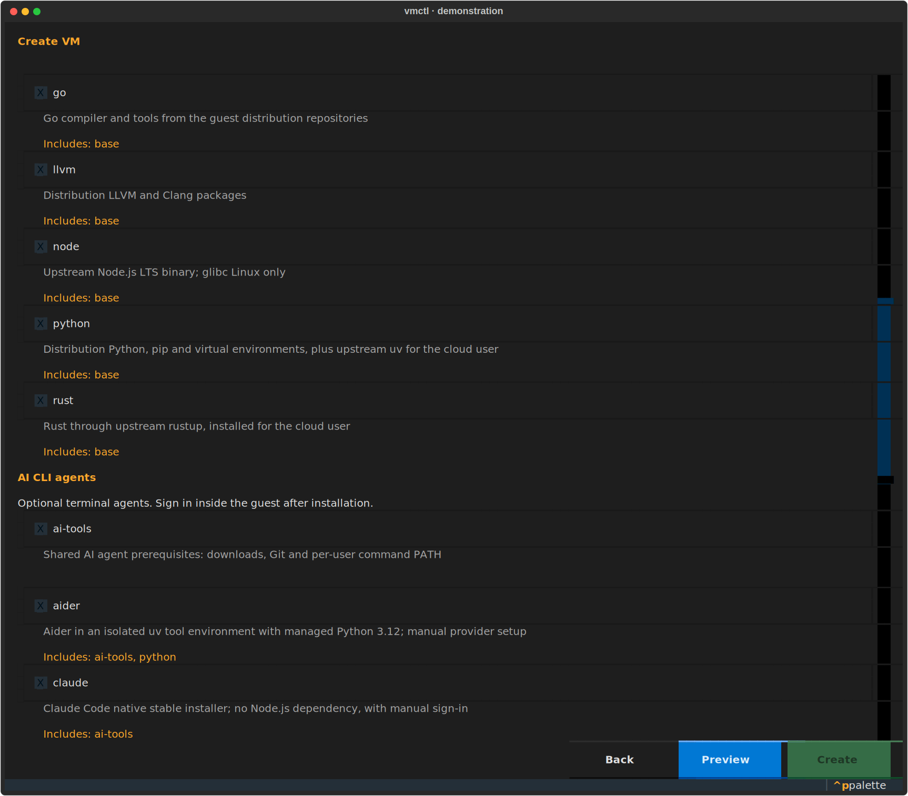
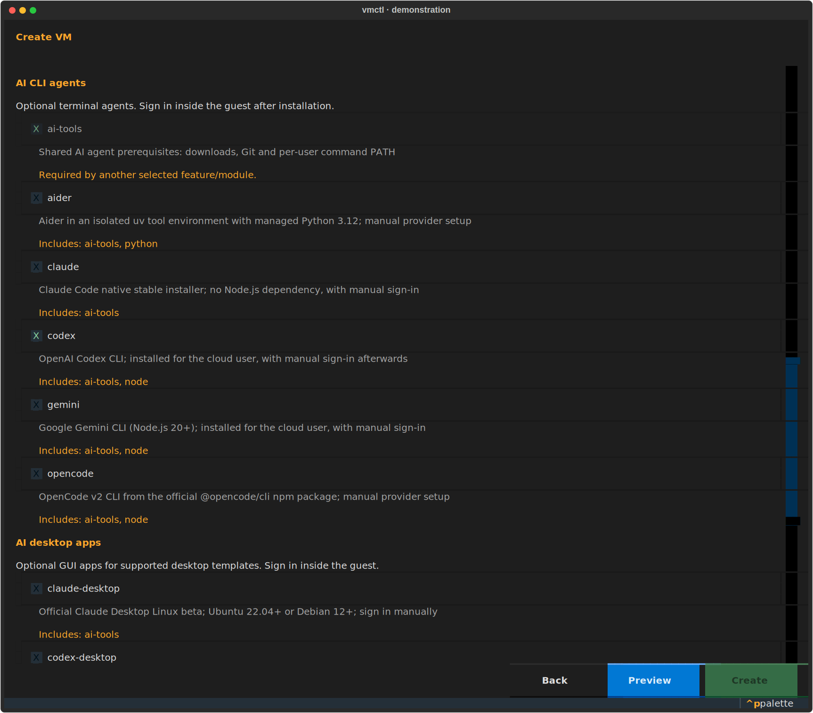
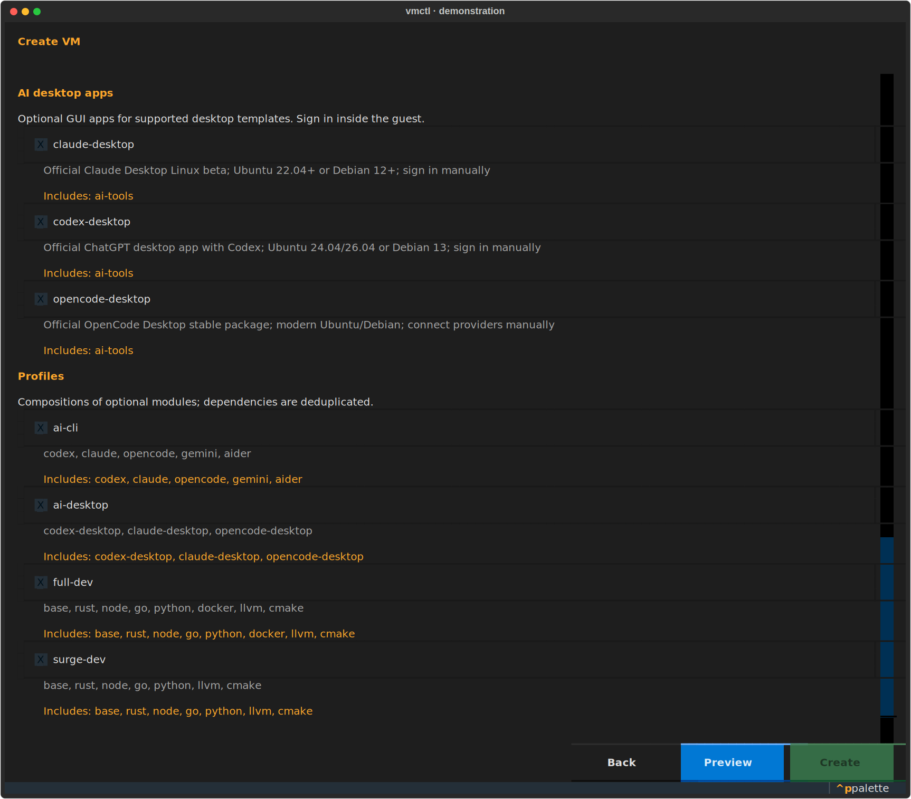

# vmctl

Manage Proxmox VE 9 VMs from a Windows, Linux or macOS workstation using
Python 3.12+, uv, Typer and a Textual terminal interface. A Linux-only
`vmctl-worker` executes each request on the Proxmox host over OpenSSH.
No database, daemon or HTTP API.

Proxmox is the source of truth for VMs. `/etc/dnsmasq.d/vmctl-hosts.conf`
is the source of truth for vmctl DHCP reservations. Templates, host firewall,
NAT, WireGuard and public bridge configuration are not modified by this tool.

## Quickstart (Linux / WSL)

Use the same **0.5.0** release for the workstation client and server worker.
If the worker is not installed yet, follow [server installation](#install-the-executor-on-the-proxmox-host)
and [host prerequisites](#host-prerequisites) first.

1. Install from the project directory on your workstation:

   ```sh
   git clone https://github.com/vovakirdan/vmctl.git
   cd vmctl
   uv tool install . --python 3.12
   uv tool update-shell
   vmctl config init
   ```

2. Edit `~/.config/vmctl/client.toml`: set `connection.host = "pxmx"` to your
   existing SSH alias and `client.ssh_key` to your VM login **public** key.
   The bundled `pve` value is an editable example, not a hardcoded host.
   WSL has its own client settings and OpenSSH config, separate from Windows.

3. Verify SSH and inspect the server configuration:

   ```sh
   ssh pxmx true
   vmctl config validate
   vmctl templates
   vmctl presets
   vmctl bootstrap --template ubuntu-server
   ```

4. Enable Tab completion in your WSL Bash:

   ```sh
   vmctl --install-completion
   source ~/.bash_completions/vmctl.sh
   ```

5. Check a creation plan and inventory without creating a VM:

   ```sh
   vmctl create testvm ubuntu-server small --dry-run
   vmctl list
   ```

6. Browse VMs and try the creation form without changing the server:

   ```sh
   vmctl tui --read-only
   ```

   Then run `vmctl tui` when ready to create and manage VMs. Both modes use the
   same `client.toml` and SSH connection as the CLI; no extra service is needed.

The real `create` command starts the VM by default. Connect using the SSH
command printed in its result. Desktop templates prompt for a private,
confirmed password and print an RDP address without exposing that password.
A dry-run checks live prerequisites; see [storage and dnsmasq troubleshooting](#storage-and-dnsmasq-troubleshooting)
if it reports a missing include or snippets content type.

## Install the workstation client

From the project checkout on your own computer:

```sh
uv tool install . --python 3.12
uv tool update-shell
vmctl --help
vmctl config init
```

`vmctl config init` creates **only `client.toml`**, atomically and without
replacing an existing file. It needs no local administrator privileges and
does not contact the server. Its default directory is:

| Client OS | Directory |
| --- | --- |
| Linux | `$XDG_CONFIG_HOME/vmctl`, normally `~/.config/vmctl` |
| macOS | `~/Library/Application Support/vmctl` |
| Windows | `%APPDATA%\vmctl` |

`--config-dir PATH` overrides this client directory. The command prints the
actual directory, so you can edit `client.toml` there. Its bundled example is
[`config/client.toml`](config/client.toml):

```toml
[connection]
host = "pxmx"
worker = "/opt/vmctl/bin/vmctl-worker"
config_dir = "/etc/vmctl"
sudo = false
connect_timeout = 10
operation_timeout = 3600

[client]
ssh_key = "~/.ssh/id_ed25519.pub"
completion_timeout = 3
```

`connection.host` is an OpenSSH alias. Authentication, identity files, port and
ProxyJump belong in your workstation's OpenSSH config (`~/.ssh/config`):

```sshconfig
Host pxmx
    HostName 10.200.0.1
    User root
    IdentityFile ~/.ssh/pve_ed25519
    IdentitiesOnly yes
```

The VM public key in `client.ssh_key` is independent of the SSH connection
identity. `--ssh-key PATH` also refers to a file on **your computer**. The client
validates and sends its contents; no workstation path is interpreted on the
server. Relative public-key paths resolve against the client configuration
directory. Private keys are never sent by vmctl.

Install OpenSSH and make sure `ssh` is on PATH. Establish your existing WireGuard
route to `10.200.0.1`, then use an ordinary interactive SSH connection once to
verify the host fingerprint and populate known_hosts. Unlock a passphrase-protected
identity in your local SSH agent if necessary:

```sh
ssh pxmx true
```

vmctl subsequently uses BatchMode, strict host-key checks, no terminal and no
agent forwarding. It does not change SSH, WireGuard or firewall configuration.

## Install the executor on the Proxmox host

Run these commands **on the Proxmox host as root**, from the same version's
checkout, with uv already available:

```sh
UV_TOOL_DIR=/opt/vmctl/tools UV_TOOL_BIN_DIR=/opt/vmctl/bin uv tool install . --python 3.12
/opt/vmctl/bin/vmctl-worker --help
/opt/vmctl/bin/vmctl --local config init
/opt/vmctl/bin/vmctl --local config validate
```

Keep `/opt/vmctl` and server configuration owned by the administrator. The
absolute worker path works without relying on a login shell's PATH. An existing
wheel can be supplied to `uv tool install` instead of `.`. Install compatible
versions on both sides; this release is **0.5.0**, with protocol version **1**.

`vmctl --local config init` installs the server TOML files, system features,
development modules and guest scripts into `/etc/vmctl`. It never installs
`client.toml` there. Missing files are created atomically and existing files
are preserved, including after upgrades and when installing from a wheel.
Use `vmctl --local --config-dir PATH config init` for another server directory.
Administrative configuration and guest scripts are trusted input; scripts run
as root inside the guest and never execute on the host.

For an unprivileged SSH account, set `connection.sudo = true` and configure
noninteractive sudo access to the administrator-owned worker on the server.
The client runs `sudo -n -- /opt/vmctl/bin/vmctl-worker --config-dir /etc/vmctl`;
it never asks for or transfers a sudo password. The worker requires privileges
for Proxmox, dnsmasq configuration, service restarts and its shared lock.

After reviewing server settings, run these read-only checks on your workstation:

```sh
vmctl config validate
vmctl templates
vmctl presets
vmctl list
vmctl create work ubuntu-desktop normal --dry-run
```

Templates, presets and bootstrap definitions are loaded **on the server** for
every request. `config validate` checks local settings, protocol compatibility
and the server definitions. The client does not keep copies of the server's
resource or bootstrap configuration.

## Direct host mode and migration

SSH is now the default. Existing host commands require `--local`; it uses the
same services and accepts the previous server configuration:

```sh
vmctl --local --config-dir /etc/vmctl presets
vmctl --local create api-test ubuntu-server small --dry-run
```

Direct mode requires Linux and sufficient host privileges. In this mode,
`--config-dir` defaults to `/etc/vmctl` and public-key defaults still come from
server `config.toml`. A native workstation never imports the host adapters just
to display help or initialize client settings.

For development from a checkout:

```sh
uv sync --locked
uv run vmctl --help
uv run vmctl --local --config-dir ./config config validate
uv run vmctl --local --config-dir ./config templates
uv run vmctl --local --config-dir ./config presets
```

`uv sync --locked` uses the committed dependency lock. Tool installation resolves
runtime dependencies separately from `uv.lock`.

## Host prerequisites

The example files describe this network:

| Setting | Value |
| --- | --- |
| Management WireGuard | `wg0`, `10.200.0.1/24` |
| Private VM bridge | `vmbr1`, `10.210.0.1/24` |
| Public bridge | `vmbr0`, unchanged |
| NAT | Already provided by the host |
| Reservation pool | `10.210.0.100` through `10.210.0.199` |
| Manual machines | `.20` / `.21`, outside the pool |
| Cloud user | `vmadmin` |
| Default public key in direct mode | `/root/.ssh/id_ed25519.pub` |
| Manual dnsmasq config | `/etc/dnsmasq.d/proxmox-vm.conf`, unchanged |
| Generated reservations | `/etc/dnsmasq.d/vmctl-hosts.conf` |
| Lease file | `/var/lib/misc/dnsmasq.leases`, read-only |

Required host commands: `qm`, `pvesh`, `pvesm`, `systemctl`, `dnsmasq`, `ip`
and iputils `arping` for conflict probes. On Debian, the probe binary comes from
`iputils-arping`; other implementations may have different `-D` exit semantics.
The configured dnsmasq service must already be active.

On a Debian/Proxmox host, install the ARP probe prerequisite if absent:

```sh
apt-get install --no-install-recommends iputils-arping
```


The configuration used by dnsmasq must include the generated file, for example:

```ini
# In the existing /etc/dnsmasq.conf, if an equivalent include is not already present:
conf-dir=/etc/dnsmasq.d,*.conf
```

vmctl checks this include and does not add it automatically. If the service
includes directories through command-line arguments, declare those same
specifications in `network.dnsmasq_conf_dirs`; see the troubleshooting section.
`dnsmasq_config` plus these extra directories must describe the configuration
that the running service loads.

Changing included `.conf` files requires a restart: SIGHUP does not reload
the main configuration. Each update validates the candidate, replaces it
atomically, validates the complete configuration, restarts the service and
checks that it is active. DNS/DHCP has a brief interruption during restart.
[dnsmasq manual](https://thekelleys.org.uk/dnsmasq/docs/dnsmasq-man.html).

Templates must already be local QEMU templates, have an OS disk and a cloud-init
drive, and boot an image with cloud-init and SSH. vmctl does not build templates.
Templates with custom QEMU args, hook scripts or PCI passthrough are rejected.
The supplied Ubuntu Desktop template also needs these cloud-init prerequisites
and must not contain a shared reusable GUI/RDP password.

`local` must be an active directory storage with `snippets` content enabled.
Choose another directory storage through `proxmox.snippets_storage` if needed.
vmctl checks storage and does not change its configuration. Custom cloud-init
files require snippets-capable storage.
[Proxmox Cloud-Init documentation](https://pve.proxmox.com/wiki/Cloud-Init_Support).

## Tab completion

Bash, Zsh, Fish and PowerShell completion is supported by Typer. In Bash/WSL,
use **Bash 4.4+**; macOS's bundled Bash 3.2 is too old, so use its default Zsh
or a newer Bash. In Bash,
`vmctl --install-completion` writes the completion script and adds its source
line to `~/.bashrc`. Open a new shell or source the script as in the quickstart.
Run the installer in the shell where you use vmctl. For Zsh/Fish, open a new
session after installing. To inspect the generated script without installing it:

```sh
vmctl --show-completion
```

For PowerShell, review `--show-completion` output and load the script through
your profile using your existing execution policy. Typer's built-in PowerShell
installer changes the current user's execution policy; use the manual approach
if that policy change is unwanted.

Examples (`<Tab>` means pressing the key, not entering literal text):

```text
vmctl create testvm ubu<Tab>                  # ubuntu-desktop / ubuntu-server
vmctl create testvm ubuntu-server sm<Tab>     # small
vmctl create testvm ubuntu-server small --wi<Tab>
vmctl create testvm ubuntu-server small --with rust,no<Tab>  # rust,node
vmctl create work ubuntu-desktop normal --without-system des<Tab>
vmctl info wo<Tab>                           # existing VM names
vmctl delete 10<Tab>                         # existing VMIDs
vmctl bootstrap --template ubu<Tab>
```

With both Ubuntu templates configured, Bash extends `ubu` to the common
`ubuntu-` prefix; another Tab shows alternatives according to your shell's
completion settings. Commands and flags complete locally. Template/preset,
development module/profile and system feature suggestions come from the
server's editable TOML definitions; VM names and IDs come from Proxmox.
`--cpu`, `--memory` and `--disk` suggest values from configured presets.
`--ip` suggests `auto` and pool candidates, **not guaranteed free addresses**;
creation checks availability. File paths such as `--ssh-key` use native shell
file completion. Free text such as a new VM name or description remains free text.

Dynamic SSH suggestions have a three-second deadline, configurable with
`client.completion_timeout` (1–30 seconds). A missing configuration or unreachable
server produces no dynamic suggestions or error messages; command, flag and file
completion remains available. No provisioning, password prompt, IP reservation
or guest script runs during completion. No persistent completion cache is stored.
When the parsed command context exposes a selected template, module/feature
suggestions are filtered for compatibility; normal creation always validates it.

## Updating an installed version

Installing a project with `uv tool install .` does not follow later source edits.
After changing or pulling the project, reinstall both client and worker:

```sh
# On your workstation, from the updated project directory:
uv sync --locked
uv build --wheel
uv tool install . --python 3.12 --force --reinstall
vmctl --install-completion

# On Proxmox, from the same updated project directory:
UV_TOOL_DIR=/opt/vmctl/tools UV_TOOL_BIN_DIR=/opt/vmctl/bin uv tool install . --python 3.12 --force --reinstall
/opt/vmctl/bin/vmctl --local config init
/opt/vmctl/bin/vmctl --local config validate
```

A wheel from `dist/` may replace `.` on both sides. Reinstalling and `config init`
preserve existing settings; add new settings explicitly when needed. Version
0.5.0 adds optional AI CLI agents and Linux desktop apps with grouped selections: update the worker
as well as the client. Reopen the shell after refreshing completion.

`config init` adds the new module files and uv installer, but preserves your
existing `/etc/vmctl/profiles.toml`. To extend an existing `surge-dev`, add `go`
and `python` to its members on the server, then run `config validate`.
New installations include them in `surge-dev` and `full-dev` automatically.
The same preservation applies to the new `ai-cli` and `ai-desktop` aliases:
add their compositions from [AI bootstrap](#ai-agents-and-desktop-apps) to an
existing server `profiles.toml` if you want them. Individual module names work
without those aliases. AI modules are not added to `surge-dev` or `full-dev`.

If the checkout is only on your workstation, upload the wheel and reinstall the
worker over your existing SSH alias. These commands assume root access through
`pxmx` and uv installed at `/root/.local/bin/uv`; adjust that uv path if needed:

```sh
scp dist/vmctl-0.5.0-py3-none-any.whl pxmx:/tmp/
ssh pxmx 'UV_TOOL_DIR=/opt/vmctl/tools UV_TOOL_BIN_DIR=/opt/vmctl/bin /root/.local/bin/uv tool install /tmp/vmctl-0.5.0-py3-none-any.whl --python 3.12 --force --reinstall'
ssh pxmx '/opt/vmctl/bin/vmctl --local config init'
vmctl config validate
vmctl tui --read-only
```

Deployment remains manual. CI runs checks and builds packages; it does not push
new releases onto your privately connected Proxmox host.

## Terminal interface

From an updated project checkout on your workstation:

```sh
uv sync --locked
uv run vmctl tui --read-only
```

Read-only mode displays inventory and details and lets you open the creation
form and check its plan. Create, Start, Shutdown, Reboot and Delete are disabled.
Plans may perform the same ARP conflict probes as CLI dry-runs; they do not
clone or change VM configuration, reservations or services. Close the app, then
enable management when ready:

```sh
uv run vmctl tui
```

The installed tool works the same way: `vmctl tui`. Use the global
`--config-dir PATH` before `tui` to choose another client configuration.
The header identifies the selected SSH target. The table shows VMID, name,
status, template, CPU, memory and reserved or detected IP; search narrows that
table. Click a VM row or press Enter to open its live metrics and configuration.
Click the **IP cell** to copy that exact VM's address without opening details;
the details screen also has a **Copy IP** button. System features, development
modules, SSH and desktop RDP information remain available in the expandable
configuration section.
Refresh also reloads template, preset and bootstrap definitions from the SSH
worker. With direct `--local` execution, reopen the TUI after editing configuration.
Start, Shutdown, Reboot and Delete operate on the selected VM after a targeted
confirmation. Shutdown requests a graceful guest shutdown, with no hard-stop
fallback.

The single creation form groups its controls by purpose:

| Group | Controls and behavior |
| --- | --- |
| Basic | VM name, template and resource preset |
| Resources | CPU, memory and disk overrides; the template disk is never shrunk |
| System features | Guest infrastructure, such as `qemu-agent` and `desktop-rdp`; template defaults are selected automatically |
| Development modules | Optional languages and utilities, such as `rust`, `node`, `go`, `python`; initially empty |
| AI CLI agents | Optional terminal coding agents; required Node/Python dependencies are selected and locked automatically |
| AI desktop apps | Optional official graphical apps; available only on compatible desktop templates |
| Profiles | Compositions such as `surge-dev`, `ai-cli`, `ai-desktop`; dependencies are deduplicated |
| Advanced | IP, local SSH public-key path, description, start after creation, SSH wait timeout and skipping desktop password setup |

Each checkbox has a visible description from the server definition and explains
dependencies or OS compatibility. Selecting a feature/module resolves its
dependencies once; incompatible choices are unavailable for the selected
template. Changing the template recomputes the system defaults. Development
tools stay opt-in, including for desktop VMs.

In Advanced, **Start after creation** is checked by default; clear it to keep
the clone stopped until its first boot. **Skip desktop password** leaves GUI/RDP
authentication to another setup and displays a warning. The SSH wait timeout
waits for a banner after starting and does not check completed installations.

For Ubuntu Desktop, `desktop-rdp` selects its `qemu-agent` dependency and uses
GNOME Flashback for RDP, while the console keeps its normal GNOME/Wayland
session. Desktop creation asks for a masked password and confirmation after
preflight. Passwords never appear in the plan, progress or result. The advanced
option to skip password setup is intended for guests with another authentication
setup. No public RDP port or host firewall rule is added.

Use Preview to inspect the effective resources and resolved selections before
Create. Progress shows actual worker messages, rather than an estimated
percentage. Creation success does not prove guest bootstrap completion; an SSH
banner check only establishes that an SSH service responds. If the connection
fails during an operation, inspect and refresh the VM state before retrying.

Keyboard shortcuts: `Ctrl+N` opens the creation form, `Ctrl+R` refreshes,
`/` focuses search, `Enter` opens details from the VM table and `Q` quits.
Typing in a text input does not trigger search or quit shortcuts. Buttons also
support mouse interaction.

### Screenshots

These are captures of the real Textual interface with a reproducible fake worker;
VM names and metric values are demonstration data. The renderer is in
[`docs/render_screenshots.py`](docs/render_screenshots.py).

Inventory, including an existing VM detected through DHCP:



The creation form separates system integration from optional development tools:



Metrics belong to the selected VM:



Development selections and their descriptions farther down the same form:



### Addresses and clipboard

A managed reservation takes display priority. Other private-network addresses
are discovered through the guest agent, unexpired DHCP leases, static cloud-init
configuration, and the host's neighbor table, in that order. Guest/lease/neighbor
observations match the VM's configured MAC on the private bridge. These reads
never adopt an address into vmctl reservations or edit manual DHCP configuration.
`vmctl list` and `vmctl info` show the source; details distinguish **Managed IP**
from observed addresses. `unknown` means no eligible observation was available,
and an observed address does not prove the guest is currently reachable.

Copy runs on the workstation: WSL/Windows use `clip.exe`, macOS uses `pbcopy`,
and Linux uses `wl-copy`, `xclip` or `xsel` when available. Otherwise vmctl sends
an OSC52 clipboard request; the terminal must allow it. An unconfirmed terminal
request is reported as a request, not as successful clipboard delivery.

### Per-VM graphs

Only the open VM details screen polls metrics, every five seconds. It loads
the previous hour of minute-averaged Proxmox RRD history once, then collects
current samples. CPU and memory use a fixed 0–100% scale; network receive/transmit
and disk read/write auto-scale in bytes per second. Sample spacing varies between
historical and live data; dots mark missing data. Counter resets, reboots and
failed requests interrupt rate calculation rather than creating traffic spikes.
Closing details stops polling. No monitoring daemon or history database is added.

Proxmox reports the selected VM's usage: CPU is relative to its assigned vCPUs,
memory is host-reported VM memory, and disk graphs show **I/O**, not filesystem
free space. This is not an in-guest process monitor. Metrics need no guest SSH
credentials or guest agent; IP discovery can use the agent when available.
Live CPU uses Proxmox's cached VM sample, normally refreshed by
[pvestatd](https://raw.githubusercontent.com/proxmox/pve-manager/master/PVE/Service/pvestatd.pm) about
every ten seconds, so successive five-second polls can repeat the value.
`vmctl stats NAME_OR_VMID` prints a read-only snapshot with cumulative byte
counters; live rates are available in the TUI.

## Commands

| Command | Purpose |
| --- | --- |
| `create NAME TEMPLATE PRESET` | Full clone, resource configuration, DHCP reservation and cloud-init; starts by default |
| `list` | VM names/IDs, status, resources and reserved/detected IPs with their source |
| `info NAME_OR_VMID` | Configuration, system/development features and RDP metadata |
| `stats NAME_OR_VMID` | Selected VM CPU, memory, uptime and cumulative network/disk counters |
| `start NAME_OR_VMID` | Start a stopped VM |
| `shutdown NAME_OR_VMID [--yes]` | Confirm and request a graceful guest shutdown; no hard-stop fallback |
| `reboot NAME_OR_VMID [--yes]` | Confirm and request a guest reboot |
| `delete NAME_OR_VMID` | Confirm, stop, destroy and release managed resources |
| `tui [--read-only]` | Terminal inventory, creation form and VM actions; optional browse/preview-only mode |
| `templates` / `presets` | Available template names and resource defaults |
| `bootstrap [--template NAME]` | Separate system features, development tools, AI agents, desktop apps and profiles |
| `config init` / `config validate` | Initialize client settings / validate client and server definitions |
| `COMMAND --help` | Detailed positional argument and option descriptions |

Common creation options:

| Option | Meaning |
| --- | --- |
| `--start` / `--no-start` | Start after provisioning / leave powered off until first boot |
| `--with rust,node,codex` | Optional development/AI tools; resolve and deduplicate dependencies |
| `--with-system NAME` | Add guest infrastructure features, independent of development tools |
| `--without-system desktop-rdp` | Disable automatic desktop RDP; keep other template defaults |
| `--cpu 16 --memory 48G --disk 160G` | Override preset resources; never shrink the template disk |
| `--ssh-key PATH` | Workstation OpenSSH public key for VM login |
| `--ip auto` / `--ip ADDRESS` | Allocate a free reservation / request a checked pool address |
| `--wait 120` | Wait for an SSH banner from the host; does not verify bootstrap completion |
| `--no-desktop-password` | Skip desktop password setup when another authentication method exists |
| `--description TEXT` | Description saved in Proxmox |
| `--dry-run` | Read-only live prerequisite checks and plan, with no password prompt |

Template defaults determine system features (`qemu-agent`, and `desktop-rdp`
for the bundled desktop template). No development modules run unless requested
with `--with`. See `vmctl create --help` and `vmctl delete --help` for details.

Server definitions can also be inspected directly without Proxmox using
`vmctl --local --config-dir PATH config validate`, `templates` and `presets`.
From a workstation, these commands query the configured server:

```sh
vmctl config validate
vmctl templates
vmctl presets
```

Safe previews from your workstation:

```sh
vmctl create api-test ubuntu-server small --dry-run
vmctl create surge-dev ubuntu-server large --with surge-dev,docker --dry-run
vmctl create work ubuntu-desktop normal --dry-run
vmctl delete 104 --dry-run
vmctl start compat --dry-run
vmctl shutdown api-test --dry-run
vmctl reboot api-test --dry-run
```

Dry-run does not clone, obtain/reserve a VMID, write snippets or reservations,
create a lock file, or restart services. It checks live prerequisites and may
send ARP conflict probes. The eventual MAC and VMID are unknown; IP availability
is checked again during execution. Dry-run never prompts for a desktop password.

Operational examples, **not executed during development**:

```sh
vmctl create api-test ubuntu-server small
vmctl create surge-dev ubuntu-server large --with rust,node,go,python,llvm,cmake
vmctl create surge-dev ubuntu-server large --with surge-dev,docker
vmctl create compat alpine small --no-start
vmctl create big-test debian heavy --cpu 16 --memory 48G --disk 160G \
  --ssh-key ~/.ssh/workstation.pub --description 'Private development VM'
vmctl create ssh-test ubuntu-server normal --ip 10.210.0.105 --wait 120
vmctl create work ubuntu-desktop normal
vmctl create work-no-rdp ubuntu-desktop normal --without-system desktop-rdp
vmctl create desktop-dev ubuntu-desktop large --with rust,node,docker
vmctl list
vmctl info surge-dev
vmctl stats surge-dev
vmctl start compat
vmctl shutdown surge-dev
vmctl reboot surge-dev --yes
vmctl delete surge-dev
vmctl delete 104 --yes
```

`--start` and `--ip auto` are the defaults. `--wait` checks an SSH banner;
it does not authenticate, verify the host key or prove bootstrap completion.
A readiness timeout retains the VM and is reported explicitly.

Start, shutdown and reboot also accept an unambiguous name or VMID. Shutdown and
reboot ask for confirmation unless `--yes` is supplied. These actions do not
change reservations or guest bootstrap configuration. Templates and reserved
template VMIDs cannot be targeted by lifecycle commands, and locked VMs are
rejected. Start requires a stopped VM; shutdown and reboot require a running VM.
Each command accepts `--dry-run` to inspect its target without changing state.
The guest shutdown timeout is configurable through `[proxmox].stop_timeout`
on the server (120 seconds by default). Reboot may still be restarting when
Proxmox returns; the result does not establish guest readiness.

`delete` can destroy **any ordinary VM on the selected server**, including manually created VMs,
after confirmation or with `--yes`. It cannot delete templates or VMIDs 9000–9099.
It removes only reservations matching that VM's MAC and vmctl-owned snippets.
Ambiguous names require an explicit VMID. List hides templates and includes
manually created VMs; unknown template/IP information is displayed as unknown.

`--with` selects optional development/AI modules and profiles. `--with-system` adds system
features; `--without-system` disables them. Both system options accept a
comma-separated list. Disabling a dependency while retaining a feature that
requires it fails before cloning. The creation summary and `info` show system
features and optional modules separately.

Memory sizes accept MiB by default; disk sizes accept GiB by default. `M/G`
and `MiB/GiB` use binary units. Disk requests must be whole GiB. A larger
template disk is retained and reported; shrinking is never requested. When
multiple disks exist, the boot order selects the first data disk; otherwise set
`disk_device = "scsi0"` in the corresponding template entry.

## Editable configuration and bootstrap

Every worker invocation rereads server TOML; there is no reload daemon or Python
module registry. All server paths can be configured; relative server paths resolve
against `connection.config_dir` (or `--config-dir` in direct host mode).

```text
/etc/vmctl/
  config.toml              # Host, paths, network, storage, timeouts, binaries
  templates.toml           # Template VMIDs and OS information
  presets.toml             # Resource defaults
  profiles.toml            # Compositions of optional modules/profiles
  bootstrap/system/*.toml  # System features and automatic selection
  bootstrap/modules/*.toml # Development/AI modules and OS implementations
  bootstrap/scripts/*     # Optional guest-only scripts
```

Add a preset by adding a TOML table:

```toml
[presets.build]
cpu = 16
memory_mib = 49152
disk_gib = 160
```

For a new module, create `bootstrap/modules/debug-tools.toml`:

```toml
name = "debug-tools"
description = "Optional debugging utilities"
dependencies = ["base"]
group = "development"

[implementations.debian]
packages = ["gdb", "strace"]
commands = [["printf", "%s\n", "Debug tools installed"]]

[implementations.rhel]
packages = ["gdb", "strace"]

[implementations.alpine]
packages = ["gdb", "strace"]
```

`group` is editable presentation metadata: `development` (the default for old
definitions), `ai-cli`, or `ai-desktop`. Set `desktop_only = true` for a GUI module.
Desktop eligibility is enforced by the domain implementation lookup, so CLI plans,
TUI choices and rendering all use the same rule. OS/release support still comes
from the module's implementation tables; no Python registration is required.

Then run:

```sh
vmctl config validate
vmctl create debug-test debian small --with debug-tools --dry-run
```

Optional script and version settings in a module:

```toml
name = "custom-tool"
dependencies = ["base"]
default_version = "1.2.3"

[implementations.debian]
packages = ["curl"]
commands = [["printf", "%s\n", "Installing {version}"]]
scripts = [{file = "custom-tool.sh", args = ["{username}", "{version}"]}]
```

Create the referenced file under `bootstrap/scripts/`; it receives arguments as
`$1`, `$2`, etc. Script paths cannot escape that directory. Commands are argument
arrays, not host shell expressions. `{username}` and `{version}` are substituted
in individual arguments and package names; script content is copied unchanged.
Shell features inside a command require an explicit guest-side `sh -c` command.

Implementation selection: `distro:release` first, then `distro`, then `family`.
For example, `ubuntu:noble` overrides `ubuntu`, which overrides `debian` family.
Each module executes packages, then commands, then scripts; modules execute in
stable dependency order. Profiles recursively expand into modules and profiles:

```toml
[profiles]
surge-dev = ["base", "rust", "node", "go", "python", "llvm", "cmake"]
debug-dev = ["surge-dev", "debug-tools"]
```

Duplicate dependencies run once; cycles and unknown references fail before clone.
The module name must match its filename and cannot collide with a profile name.
The `config validate` command checks every definition and script reference.
Requested OS support is checked during create preflight. Changes affect newly
created VMs; existing guests and their cloud-init snippets are not rewritten.

## System features and desktop RDP

System features have their own definitions and dependency graph, separate from
development modules and profiles. The default system directory is configured
in `config.toml`:

```toml
[bootstrap]
system_features_dir = "bootstrap/system"
```

The supplied features are `qemu-agent` and `desktop-rdp`. `qemu-agent` applies
to all templates by default and provides guest integration, CA certificates
and sudo. `desktop-rdp` applies when `desktop = true` and depends on
`qemu-agent`; shared dependencies are applied once. It does not add development
toolchains or update the whole OS.

An explicit `system_features` list in template TOML replaces automatic
selection; an empty list selects no system features. The example templates
make the selection explicit:

```toml
[templates.ubuntu-server]
vmid = 9000
family = "debian"
distro = "ubuntu"
release = "noble"
desktop = false
system_features = ["qemu-agent"]

[templates.ubuntu-desktop]
vmid = 9001
family = "debian"
distro = "ubuntu"
release = "noble"
desktop = true
system_features = ["qemu-agent", "desktop-rdp"]
```

Each `bootstrap/system/NAME.toml` declares a name, description,
`supported_families`, dependencies, an `auto_apply` rule and OS implementations.
The automatic rules are `always`, `desktop`, and `never` (the default).
Implementation matching and guest-only commands/scripts follow the development
module rules above. Dependencies stay within their category. Extend these TOML
files to add system features without editing Python. Unsupported feature/OS
combinations fail during preflight, before cloning. The supplied `desktop-rdp`
implementation supports Ubuntu and Debian; Rocky and Alpine need custom
implementations.

For example, add `bootstrap/system/guest-tools.toml`:

```toml
name = "guest-tools"
description = "Optional guest integration utilities"
supported_families = ["debian"]
dependencies = ["qemu-agent"]
auto_apply = "never"

[implementations.debian]
packages = ["curl"]
files = [{path = "/etc/vmctl-guest-note", content = "Managed guest\n", owner = "root:root", permissions = "0644"}]
```

File definitions are staged through cloud-init and installed atomically.
Paths, contents and owners support the configured `{username}` placeholder.
Select the feature independently of development modules:

```sh
vmctl config validate
vmctl create guest-test debian small --with-system guest-tools --dry-run
```

When upgrading an existing configuration, rerun `vmctl --local config init` on the host to install the
new system definitions and scripts. Existing files are preserved. The old
`bootstrap.system_module` setting is a legacy migration setting; its module is
excluded from development selection. Move any custom integration from the old
`bootstrap/modules/system.toml` into `bootstrap/system/qemu-agent.toml`, then
remove the old setting and module once migrated.

For desktop templates, the local client prompts for a password and confirmation with
hidden input, including with `--no-start`. This is the guest account's GUI/RDP
password; SSH remains configured for public-key authentication. The prompt also
applies when RDP is disabled because local GUI login still needs authentication.
Server templates and dry-runs do not prompt.

```sh
vmctl create work ubuntu-desktop normal
vmctl create work-no-rdp ubuntu-desktop normal --without-system desktop-rdp
vmctl create externally-authenticated ubuntu-desktop normal --no-desktop-password
```

`--no-desktop-password` skips setup and warns that GUI/RDP login may be unusable
without another authentication setup. Plaintext passwords are never written to
TOML, printed, logged or passed to external command arguments. Cloud-init receives
a salted SHA512-crypt hash with 500000 rounds in a mode-0600 user-data snippet.
Hashing takes place locally; only the hash travels through SSH stdin. The public
plan and worker results exclude user-data and passwords; `info` redacts cloud-init
credentials on the server before transfer.
Its `hashed_passwd` field also updates users already present in the template.
[Cloud-init users and groups reference](https://docs.cloud-init.io/en/latest/reference/modules.html#users-and-groups).
Treat that snippet as sensitive; it contains a password hash even though the
plaintext is not stored.

On Ubuntu/Debian, `desktop-rdp` installs `xrdp`, `xorgxrdp`,
`gnome-session-flashback`, `dbus-x11`, `ssl-cert` and required X11 session utilities.
The agent package comes from its `qemu-agent` dependency. It atomically creates
`/home/vmadmin/.xsession`, owned by `vmadmin:vmadmin` with mode `0600`:

```sh
exec gnome-session --session=gnome-flashback-metacity
```

The path and ownership use the top-level `username` setting in `config.toml`,
rather than assuming `vmadmin`. XRDP uses GNOME Flashback on X11 while the console
retains its normal GNOME/Wayland session. No GNOME systemd session targets are
patched. The XRDP service account joins `ssl-cert` to read the packaged TLS key.
Bootstrap enables `xrdp`, restarts `xrdp-sesman` and `xrdp` to apply that group
membership, and checks that both services are active. It starts the guest agent
without requiring `systemctl enable` to work for its potentially static unit.

Successful creation shows the RDP address and user only when a desktop VM has
`desktop-rdp` selected. It never shows the password:

```text
SSH:
  ssh vmadmin@10.210.0.106

RDP:
  10.210.0.106:3389
  user: vmadmin
```

Use the existing private VM network and WireGuard route for RDP. vmctl does not
add public port forwards or modify the Proxmox firewall. `info` reports desktop
capability, selected system features, development modules and the configured
RDP endpoint from non-secret Proxmox description metadata. These are provisioning
details, not a probe of the guest's services; older or manually created VMs may
have unknown metadata. Server VMs omit the RDP section.

## Development bootstrap defaults

Development bootstrap is opt-in; `legacy-test debian small` installs no
Rust, Node.js, Go, Docker, LLVM or build toolchains.

| System feature | Ubuntu / Debian | Rocky 9 | Alpine |
| --- | --- | --- | --- |
| qemu-agent | apt / systemd | dnf / systemd | apk / OpenRC |
| desktop-rdp | XRDP / GNOME Flashback | No supplied implementation | No supplied implementation |

| Development module | Ubuntu / Debian | Rocky 9 | Alpine |
| --- | --- | --- | --- |
| base | Distribution build utilities | Distribution build utilities | Distribution build utilities |
| rust | Upstream rustup stable | Upstream rustup stable | Upstream rustup stable |
| node | Official upstream LTS binary | Official upstream LTS binary | No supplied implementation |
| go | `golang-go` | `golang` | `go` (community repository) |
| python | Python 3, pip, venv + user uv | Python 3, pip, venv + user uv | Python 3, pip, venv + user uv (community repository) |
| docker | Official stable apt repository | RHEL-compatible Docker CE repository | No supplied implementation |
| llvm, cmake | Distribution packages | Distribution packages | Distribution packages |

`base` is opt-in or a development module dependency. Rust installs for `vmadmin`;
Node installs under `/usr/local`. Docker requires `sudo docker`; the cloud user
is not automatically added to the root-equivalent docker group. Rust stable and
Node LTS channels are resolved during guest bootstrap, so versions can change
between creations. Pin `default_version` to an exact Rust toolchain or Node
version in module TOML for repeatability. Docker's supplied scripts support the
stable channel only. The service request model supports per-module version
overrides for future frontend flags.

`go` and `python` use distribution package versions (`default_version = "system"`);
numeric overrides are rejected unless your custom definition implements
`{version}`. Python also installs [upstream uv](https://docs.astral.sh/uv/getting-started/installation/)
for the configured cloud user under `~/.local/bin`. Its PATH fragment is rendered
atomically and applies only to that account. `python3 -m pip` is available; use
virtual environments for project dependencies, preserving the distribution's
externally managed Python. Alpine requires its community repository to be enabled
in the template. The installer does not change repository configuration.

Bundled profiles are editable compositions, not mutually exclusive modes:

```toml
[profiles]
surge-dev = ["base", "rust", "node", "go", "python", "llvm", "cmake"]
full-dev = ["base", "rust", "node", "go", "python", "docker", "llvm", "cmake"]
```

For example, `--with go,python` installs just their dependencies and those tools;
`--with surge-dev,docker` adds Docker to the composition without duplicate modules.
Nothing is installed into an existing VM by upgrading the client or worker.

Node binaries are for glibc x86_64/aarch64 guests. Unsupported Alpine node/docker
requests fail before cloning. Add your own Alpine implementations to enable them.
The example Alpine release is `unknown`; set the real release if using
release-specific implementations. Postgres and Redis can be added through module
files; they are not supplied in this release.

Custom user-data explicitly configures the non-root user, public keys,
hostname, disabled SSH password authentication and bootstrap. Proxmox supplies
DHCP network data. Scripts are bundled into a persistent snippet, making creation
independent of subsequent edits to the source definitions.

VM creation success means clone/configuration/reservation/start completed.
Guest bootstrap completion is **not verified**. To inspect a running guest:

```sh
ssh vmadmin@10.210.0.105 'sudo cloud-init status --long'
```

## AI agents and desktop apps

AI tools are optional workload modules, separate from system features. Select
individual names or a profile through `--with`; the TUI shows **AI CLI agents**
and **AI desktop apps** separately from languages and utilities. Nothing in these
groups is selected automatically for server or desktop VMs.





| Module | Installation and dependencies | Supplied guest support |
| --- | --- | --- |
| `codex` | `@openai/codex` with npm; requires `node` | Ubuntu/Debian, Rocky |
| `claude` | Official native Claude Code installer; no Node dependency | Ubuntu/Debian, Rocky, Alpine |
| `opencode` | Current OpenCode v2 `@opencode/cli` with npm; requires `node` | Ubuntu/Debian, Rocky |
| `gemini` | `@google/gemini-cli` with npm; requires `node` | Ubuntu/Debian, Rocky |
| `aider` | `aider-chat` in a user uv tool environment with Python 3.12 and pip; requires `python` | Ubuntu/Debian, Rocky |
| `codex-desktop` | Official ChatGPT desktop app with Codex | Desktop Ubuntu 24.04/26.04 or Debian 13 |
| `claude-desktop` | Official Claude Desktop Linux beta, signed apt repository | Desktop Ubuntu 22.04/24.04/25.10/26.04 or Debian 12/13 |
| `opencode-desktop` | Official OpenCode stable `.deb` | Desktop Ubuntu 24.04/26.04 or Debian 13 |

These methods follow [OpenAI CLI guidance](https://developers.openai.com/cookbook/examples/codex/using_goals_in_codex),
[Claude Code setup](https://code.claude.com/docs/en/setup),
[OpenCode v2](https://opencode.ai/v2/docs),
[Gemini installation](https://geminicli.com/docs/get-started/installation/), and
[Aider's uv method](https://aider.chat/docs/install.html#install-with-uv).
Desktop packages come from [OpenAI's Linux app guide](https://learn.chatgpt.com/docs/linux/linux-app),
[Claude Desktop](https://support.claude.com/en/articles/10065433-install-claude-desktop),
and [OpenCode downloads](https://opencode.ai/download). Supported aliases are
declared in each TOML implementation table; use accurate template `distro`
and `release` metadata. For example, OpenAI does not list Ubuntu 25.10 as a
supported desktop release, so that combination is unavailable by default.

```toml
[profiles]
ai-cli = ["codex", "claude", "opencode", "gemini", "aider"]
ai-desktop = ["codex-desktop", "claude-desktop", "opencode-desktop"]
```

These aliases compose with development profiles. Selecting `codex`, `opencode`
or `gemini` also selects `node`, installs it first, and prevents deselecting it
while a chosen agent requires it. Shared prerequisites (`ai-tools`) and runtimes
are installed once. Claude uses its native installer; desktop packages do not
pull in Node. Unsupported GUI/OS or runtime combinations fail during planning.

```sh
vmctl bootstrap --template ubuntu-server
vmctl bootstrap --template ubuntu-desktop
vmctl create ai-work ubuntu-server normal --with codex,claude,opencode --dry-run
vmctl create full-ai ubuntu-server large --with surge-dev,ai-cli --dry-run
vmctl create ai-desk ubuntu-desktop normal --with ai-desktop --dry-run
```

Remove `--dry-run` to create and provision the selected VM. Agents install for
the configured cloud user: npm uses a per-user prefix, Aider uses an isolated
uv environment, and the native Claude installer runs without root privileges.
Guest login PATH is written atomically. `latest` npm/tool versions and Claude's
`stable` channel are editable defaults in module TOML; npm engine checks reject
incompatible Node overrides. Alpine's native Claude needs its community
repository for ripgrep and uses `USE_BUILTIN_RIPGREP=0` for the configured user.
The supplied Node/Aider modules do not offer an Alpine implementation.

After cloud-init completes, sign in or configure providers **inside the guest**
as the cloud user. vmctl never copies workstation authentication, API keys,
agent settings or login sessions into a clone, and it does not run a paid AI
request or disable agent approvals. Desktop installers register the vendor
package/menu launcher without starting the GUI app during cloud-init.
Keep base templates free of saved agent logins and API keys.
Example commands to run after connecting to the VM:

```sh
codex
claude
opencode
gemini
aider --help
```

For OpenCode, use `/connect` in its own interface. Start ChatGPT, Claude Desktop
or OpenCode Desktop from the guest's application menu over your private RDP
connection. Account and subscription requirements remain with each provider.
Creation success still does not verify completed guest installation or login;
inspect `sudo cloud-init status --long` in the guest.

## Storage and dnsmasq troubleshooting

**“Storage 'local' must have snippets enabled.”** Custom cloud-init user-data
requires snippets-capable storage. On the Proxmox web UI, open **Datacenter →
Storage → local → Edit → Content**, add **Snippets**, and keep all existing content
types selected. Then retry `create --dry-run`. Creating a `snippets/` directory
alone does not enable the storage content type. vmctl does not edit Proxmox
storage configuration. Alternatively, set `[proxmox].snippets_storage` in the
server `/etc/vmctl/config.toml` to another active directory storage that supports
snippets on the target node.
[Proxmox Cloud-Init documentation](https://github.com/proxmox/pve-docs/blob/master/qm-cloud-init.adoc).

Inspect storage settings from the Proxmox host:

```sh
pvesh get /storage/local --output-format json
```

If its current content list is **exactly** `iso,vztmpl,backup`, the equivalent
administrative change is below. If the list differs, preserve that actual list
and append `snippets`; `--content` replaces the list.

```sh
pvesm set local --content iso,vztmpl,backup,snippets
```

**“dnsmasq config must include …/vmctl-hosts.conf.”** The running service and
vmctl's validation must load the same configuration. Debian commonly includes
`/etc/dnsmasq.d` through `CONFIG_DIR` in `/etc/default/dnsmasq`, passed as `-7`,
rather than through `/etc/dnsmasq.conf`. For that setup, add this setting to the
existing `[network]` section of the **server** `/etc/vmctl/config.toml`:

```toml
[network]
dnsmasq_conf_dirs = ["/etc/dnsmasq.d,.dpkg-dist,.dpkg-old,.dpkg-new"]
```

Keep the same directory and suffix filters used by your running service.
vmctl supplies these directories to `dnsmasq --test` and checks that they include
its reservations file. This setting does not reconfigure dnsmasq itself.
If the main dnsmasq config already includes the directory, leave this list empty.
Do not add duplicate directory includes to both the main config and the service.
Re-run `vmctl create testvm ubuntu-server small --dry-run` after correcting it.
`config validate` validates definitions; creation previews additionally check
live storage and dnsmasq prerequisites.

## Failure handling and recovery

Changing commands share a bounded host lock. This serializes vmctl calls, not
external GUI/API changes or dnsmasq's dynamic allocator. Reservations, existing
lease entries, neighbor information and ARP replies exclude occupied IPs.
ARP cannot prove that a silent/offline static address is unused; active dynamic
DHCP can also race allocation in the overlapping `.100–.199` pool. Keep offline
manual reservations outside this pool and inspect reported conflicts.

The generated file has a strict format and warning. Unexpected content is
rejected rather than silently overwritten. Temporary files are hidden from
dnsmasq's config directory loading; replacements use fsync and atomic rename.
Symlink targets are rejected. On activation failure the previous file is restored
and the service is restarted with its previous configuration. Restoration
failures are reported explicitly.

Creation compensates only resources with the invocation marker written by clone.
If destruction cannot be confirmed, the reservation and snippet are retained.
A failed/timed-out clone is treated as uncertain and its VMID is reported for
manual inspection; vmctl never unlocks Proxmox tasks or destroys an uncertain VM.
Process crashes/power loss can leave resources; there is no automatic recovery
daemon or durable transaction journal. Generated reservation comments and
Proxmox description metadata identify resources for inspection.

If a clone reports an uncertain outcome, inspect tasks **on the Proxmox host**:

```sh
qm config 104
pvesh get /nodes/$(hostname -s)/tasks --output-format json
```

Wait for the Proxmox task to settle before deciding on cleanup. A later
`vmctl delete 104 --dry-run` can preview cleanup for an unlocked VM.

Delete releases DHCP only after successful destruction and an inventory check.
A DHCP failure after destroy is reported as partial deletion; the prior
reservation is retained. Resolve the dnsmasq failure, then remove the stale
reservation with a reviewed administrative atomic update and validate/restart
dnsmasq. The VM cannot be reconstructed by rollback after its disks are destroyed.

## SSH protocol and interrupted operations

Each invocation starts a fresh worker, sends one versioned JSON request through
stdin and receives JSON Lines (`hello`, `progress`, `result` or `error`). Only
allowlisted operations are accepted; invalid requests and protocol versions
fail before constructing host services. The remote shell receives only the
quoted worker path, configuration directory and optional `sudo -n`; VM names,
module lists, public keys and password hashes are never shell arguments.

`create` prints a request ID before submission. The same ID is stored in the
Proxmox invocation marker, including during cloning. Reusing an ID that already
belongs to a VM is rejected with its VMID under the host lock. This detects
an existing clone; it does not assert that all provisioning completed. Once
that VM is deleted, there is no persistent request history.

If SSH disconnects, the client is interrupted or its timeout expires without a
conclusive response to create/delete/start/shutdown/reboot, the outcome is
**unknown**. The client reports the request ID and any known VMID and never
retries automatically.
The server may have completed, may still be working or may have stopped; an
SSH session cannot guarantee that the worker survives disconnects. Inspect
`vmctl list`, `vmctl info VMID` and Proxmox tasks before retrying. A repeated
CLI command gets a new ID, so do not blindly rerun creation after a disconnect.

Delete transfers the confirmed VMID, name and configuration fingerprint. The
server rechecks that confirmation, then checks again under its mutation lock;
changed VM configuration requires another review before destruction.

## Project layout

```text
vmctl/
  pyproject.toml, uv.lock
  README.md, README.ru.md
  config/
    client.toml
    config.toml, templates.toml, presets.toml, profiles.toml
    bootstrap/{system,modules,scripts}/
  src/vmctl/
    cli.py, completion.py, client_config.py, frontend.py
    tui/                    # Textual app, creation form, per-VM metrics and dialogs
    operations.py, protocol.py, ssh.py
    worker.py, local.py
    models.py, config.py, errors.py
    services/catalog.py     # Read-only frontend choices from server TOML
    services/metrics.py     # Selected-VM current gauges and RRD history
    network/discovery.py    # Read-only private-network IP observations
    {proxmox,network,bootstrap,services,utils}/
  docs/screenshots/          # Sanitized TUI captures
  tests/
    client/                 # Portable client and fake SSH process tests
    test_worker.py          # Protocol and host services with fake Proxmox
    test_*.py               # Existing domain, bootstrap and host tests
  .github/workflows/tests.yml
```

## Development and verification

```sh
uv sync --locked
uv run pytest
uv run pytest tests/client
uv run ruff check .
uv run ruff format --check .
uv run mypy src
```

Tests use temporary paths and a stateful fake subprocess runner. They do not
require or contact Proxmox and never modify real `/etc`. Separate subprocess
tests run harmless local Python children to verify quoting, redaction and timeout
handling. Guest scripts can be syntax-checked with `sh -n` without execution.

The portable `Operations` interface is implemented by `SSHOperations` and
`LocalOperations`. The service layer accepts configuration, runner-backed adapters and a bootstrap
executor interface. It contains no Typer prompts, console tables or terminal
formatting. Feature selection, OS validation and provisioning are reusable
services. Typer and Textual are separate frontends over the same typed operations;
each provides its own presentation, confirmations and secure password input.
Blocking SSH calls run outside the TUI event loop, so progress and navigation
remain responsive.

Local tests establish parsing and orchestration behavior, not real Proxmox,
DHCP lease delivery, guest boot or upstream installer acceptance. Perform those
checks separately on disposable VMs with explicit operational authorization.

The CI workflow runs `tests/client` on native Windows, Linux and macOS with
Python 3.12–3.14, and the full host suite on Linux. Workflow setup follows the
[official setup-uv usage](https://github.com/astral-sh/setup-uv) and
[checkout documentation](https://github.com/actions/checkout).
A configured workflow is not proof of a completed native run: the current local
verification was performed on Linux. Real SSH/Proxmox/RDP acceptance remains a
separate check.
